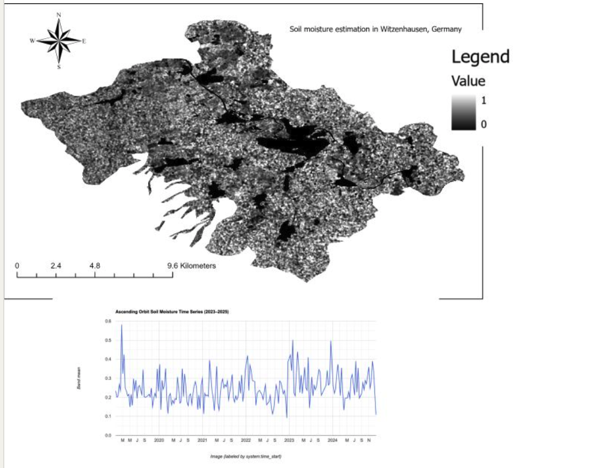

# Soil Moisture Estimation: Witzenhausen, Germany

Estimation of relative surface soil moisture from Sentinel-1 SAR backscatter using Google Earth Engine (GEE), covering the Witzenhausen region in Lower Hesse, Germany.

---

## Overview

This project derives a normalized soil moisture index from Sentinel-1 C-band SAR (VV polarization, IW mode) for both ascending and descending orbit passes. The workflow aggregates imagery into 10-day composites, converts backscatter to sigma-naught (σ⁰), applies speckle filtering, masks out water bodies and urban areas, and normalizes the result to a 0–1 index.

The output includes spatially explicit soil moisture maps and time series charts for the period 2019–2025, with export stacks covering 2023–2025.



---

## Area of Interest

| Parameter | Value |
|-----------|-------|
| Region | Witzenhausen, Lower Hesse, Germany |
| Bounding Box | 9.658°E – 9.985°E, 51.242°N – 51.419°N |
| Approximate Area | ~30 × 20 km |

---

## Data Sources

| Dataset | Description | GEE Collection |
|---------|-------------|----------------|
| Sentinel-1 GRD | C-band SAR, VV polarization, IW mode | `COPERNICUS/S1_GRD` |
| Dynamic World V1 | Land cover classification (water & urban masks) | `GOOGLE/DYNAMICWORLD/V1` |

---

## Methodology

**1. Data Filtering**
Sentinel-1 images are filtered by date (2019–2025), bounds, VV polarization, and IW instrument mode. Ascending and descending orbit passes are processed separately.

**2. 10-Day Compositing**
Images are grouped into 10-day intervals and averaged to reduce noise and increase temporal coverage. Periods with no observations are excluded.

**3. Sigma-Naught Conversion**
dB backscatter values are converted to linear sigma-naught (σ⁰) using:

```
σ⁰ = 10^(dB / 10)
```

**4. Speckle Filtering**
A 30 m focal mean filter (square kernel) is applied to reduce SAR speckle noise.

**5. Land Cover Masking**
Pixels classified as water (class 0) or urban/built-up (class 6) are masked out using the Dynamic World modal land cover map for the full time period.

**6. Normalization**
Soil moisture index is computed per pixel using min-max normalization across the full time series:

```
SM = (σ⁰ - σ⁰_min) / (σ⁰_max - σ⁰_min)
```

Values range from 0 (driest) to 1 (wettest), relative to the observed range.

---

## Outputs

| File | Description |
|------|-------------|
| `SoilMoisture_ASC_Stack.tif` | Multi-band GeoTIFF, ascending orbit SM index, 2023-2025 |
| `SoilMoisture_DESC_Stack.tif` | Multi-band GeoTIFF, descending orbit SM index, 2023-2025 |

Both exports are saved at a spatial resolution of **30 m** to Google Drive in the folder `GEE_SoilMoisture`.

Time series charts for a sample field polygon (~1 ha near 9.846°E, 51.337°N) are printed in the GEE Console for both orbit directions.

---

## Key Parameters

| Parameter | Value |
|-----------|-------|
| SAR band | VV |
| Instrument mode | IW |
| Composite interval | 10 days |
| Speckle filter | Focal mean, 30 m square kernel |
| Spatial resolution (export) | 30 m |
| Analysis period | 2019–2025 |
| Export period | 2023–2025 |

---

## Notes and Limitations

- The soil moisture index is **relative**, not an absolute volumetric water content. It reflects within-pixel temporal variability normalized to the local historical range.
- Ascending and descending passes have different local overpass times, which can introduce differences in soil moisture signals due to diurnal variation.
- Dense vegetation and surface roughness affect SAR backscatter independently of soil moisture, which may introduce noise in forested or cropland areas.
- The `desc_sm` band is currently named `"sm_ascn"` due to a copy-paste artefact in the script; it should be renamed to `"sm_desc"` for clarity.

---

## Requirements

- Google Earth Engine account with access to `COPERNICUS/S1_GRD` and `GOOGLE/DYNAMICWORLD/V1.`
- The variables `imageCollection` and `imageCollection2` must be defined before running the script (pointing to the S1 GRD and Dynamic World collections, respectively)

---

## Author

Soil moisture analysis for the Witzenhausen region, produced using Google Earth Engine.
